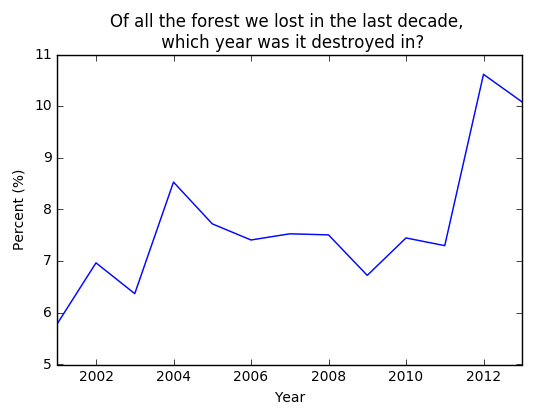

Detailed Examples of SQL2GEE's use
==================================

We present a few detailed use cases of SQL2GEE.

Finding forest-loss statistics between 2001 - 2015
--------------------------------------------------

The `Hansen et al <http://earthenginepartners.appspot.com/science-2013-global-forest/download_v1.2.html>`_ Global Forest
Change data-set shows high-resolution statistics on forest cover and loss during the past decade. These data are available
via Google's Earth Engine platform, via the data-set ID `UMD/hansen/global_forest_change_2014`.

These data have a band called `lossyear`, which shows, for every pixel where forest was lost, the year that the loss
likely occured. The integers are from 0 to 14, all values > 0 indicate year since 2000. Pixels with a 0 value indicate locations where
forest was not lost (and should be ignored).

Let's use the ST_HISTOGRAM function of the SQL2GEE library to create a step-plot (using Matplotlib), to show these data.

First, we load the required libraries, and authenticate with Earth Engine.

.. code-block:: python
   :linenos:

    from sql2gee import SQL2GEE
    import ee
    import matplotlib.pyplot as plt
    ee.Initialize()

Next, we make a request via SQL2GEE to the Hansen dataset. Calling the response property we can confirm that a histogram
has been successfully returned.

.. code-block:: python
   :linenos:

    sql = 'SELECT ST_HISTOGRAM(raster, lossyear, 15, true) FROM "UMD/hansen/global_forest_change_2015"'
    q = SQL2GEE(sql)
    q.response
    {'lossyear': [[0.0, 1291270.0],
      [1.0, 192.0],
      [2.0, 483.0],
      [3.0, 449.0],
      [4.0, 1185.0],
      [5.0, 462.0],
      [6.0, 1264.0],
      [7.0, 2156.0],
      [8.0, 514.0],
      [9.0, 343.0],
      [10.0, 1374.0],
      [11.0, 334.0],
      [12.0, 992.0],
      [13.0, 2624.0],
      [14.0, 7629.0]]}

We can extract these data and plot them as follows:

.. code-block:: python
   :linenos:

    bin_pos = []
    counts = []
    for pair in response['lossyear']:
        bin_left, count = pair
        bin_pos.append(bin_left)
        counts.append(count)
    bin_pos = np.array(bin_pos)
    counts = np.array(counts)

    percent_value = (counts[1:]/sum(counts[1:])*100.)
    year = bin_pos[1:]+2000

    plt.plot(year, percent_value)
    plt.title('Of all forest lost in the last decade, \n which year was it lost in?')
    plt.xlabel('Year')
    plt.ylabel("Percent (%)")
    plt.show()

